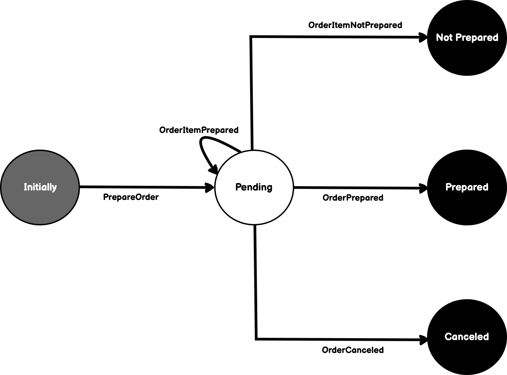
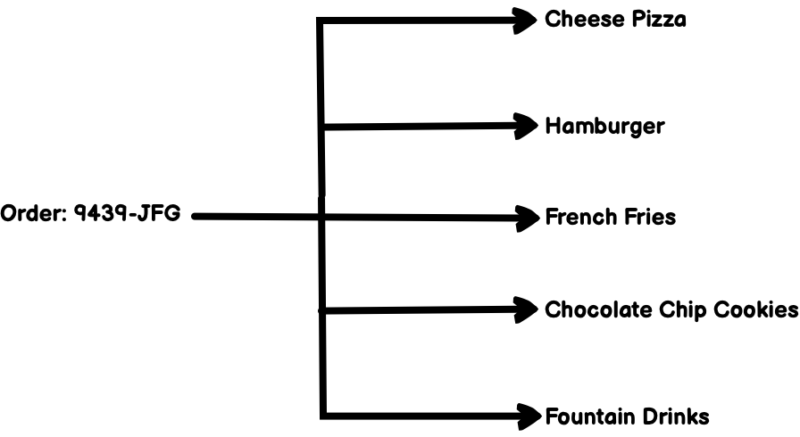
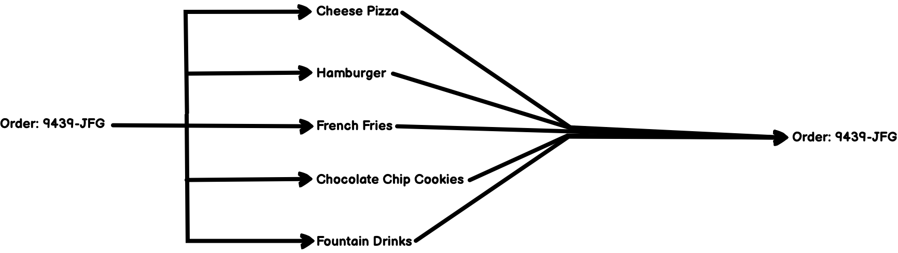
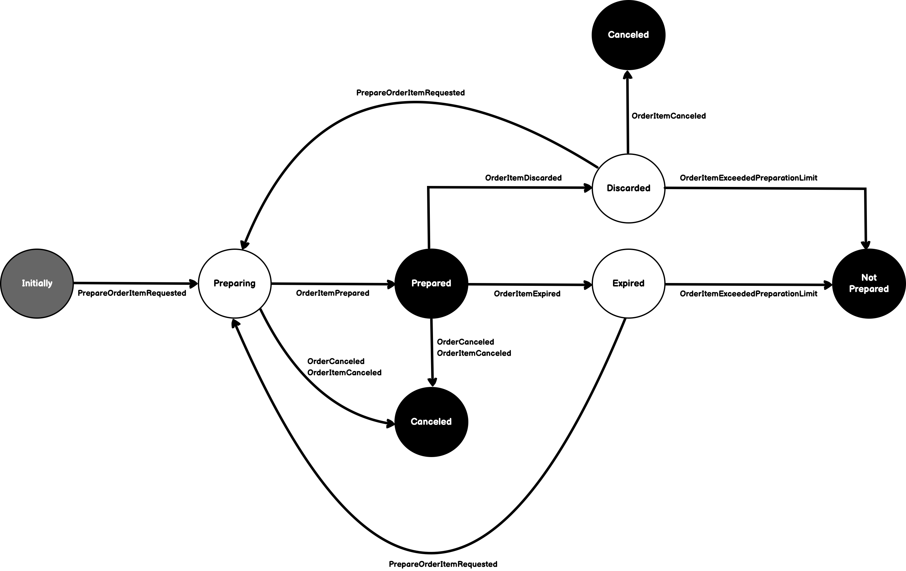
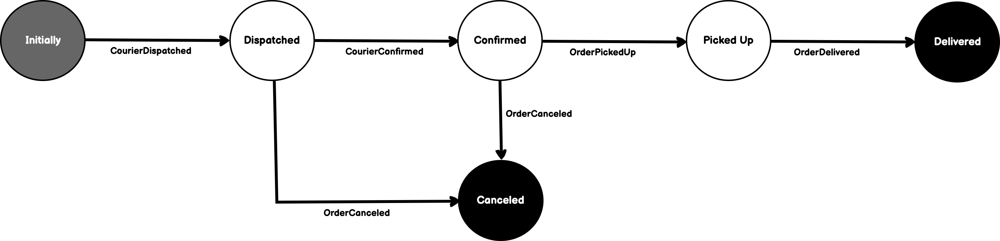
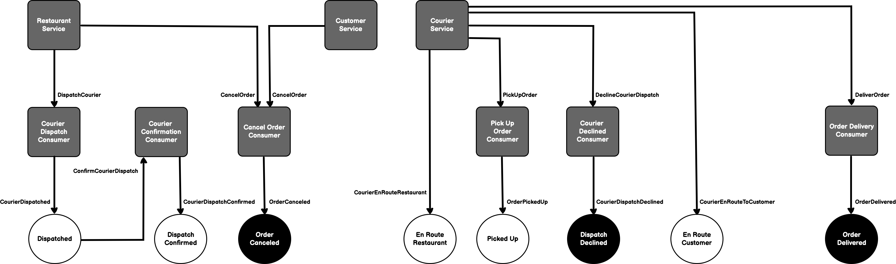

# OrderPaymentSystemExample

## Architecture

I imagined the following human actors: customer, chef/cook, kitchen staff, and courier, respectively.

- **Customer** - initiates the workflow by using a client app (e.g., DoorDash, etc.) to place a food order
- **Chef/Cook** - determines whether or not the order is valid, whether or not the kitchen can fulfill the order, prepares the food, and places the food on a shelf
for pick up
- **Kitchen Staff** - say something here
- **Courier** - arrives at the kitchen, picks up the order, and delivers said order back to the customer

### Processing Orders

An order has several meanings. To better understand, lets look at its meaning from different perspectives.
- **Customer/Courier** - from the customer or courier's perspective, an order is a single, atomic transaction between it and a restaurant.
- **Restaurant** - from the restaurant perspective, an order is a single, atomic transaction between it and a courier. To most efficiently prepare the order, however, the restaurant may require that multiple chefs or cooks prepare each item within the order in parallel.
- **Chef/Cook** - from the chef or cook perspective, an order is a set of singular requests to prepare food items in order to fulfill the order.

#### Workflow

When an order is submitted, the restaurant has to perform several tasks to fulfill said order. Firstly, the restaurant must validate if it can fulfill the
order. Factors that go into are things like whether there is enough staff on hand, whether the kitchen is in operation, whether or not there is enough
ingredients available, etc. After it has validated that it can fulfill the order, the restaurant will usually fork the order into individual orders to be
prepared by various kitchen staff. The two primary reasons for this is speed and accuracy. One person performing different tasks is normally slower and less
accurate than five people performing one task. In either case, someone at the restaurant will get the order and pull the items from where they are being stored,
package them for delivery to the customer. Delivery to the customer can take on several forms, e.g., dispatching a courier to deliver to a business or
residence, notifying the customer to pick up their food, or via a waiter. 

#### Order State Machine

In the workflow, the restaurant is responsible for facilitating the fulfillment of a order. To do so, it may require several individual items to be prepared.
Usually, there is a person responsible for communicating the order to the various kitchen staff responsible for preparing each item in the order. This
facilitator will then ensure that the order is delivered to the customer. The order status is a summary of the statuses of the items being prepared. So, we
need something to decompose (i.e. fork) an order into several work streams and gather (i.e. join) the results of each work stream into an order that
can be delivered to the customer. We will call the mechanism that facilitates the preparation of an order, Order State Machine, and the mechanism that is
responsible for preparing the items in the order, Order Item State Machine.



**Figure 1**

**Forking**

In the Pending state in figure 1, this represents a ***Fork***. We call this a Fork because a single request comes in to process an order and forks into
one or more requests to prepare items in the order. For example, a single order could have have a cheese pizza, hamburger, french fries, 3 chocolate chip
cookies, and 2 fountain drinks. Ideally, this would not be all prepared by a single person. Also, the expectation is that all of the items can be prepared
in parallel.



**Figure 2**

**Joining**

Each item are being prepared independently but somehow has to roll up to the initiating order. This is called a ***Join***. In our example, the state machine
can only transition to the *Prepared* or *Not Prepare* state until all forked transactions have been completed.
 


**Figure 3**

<br>

#### Order Item State Machine



**Figure 4**


### Customer

### Cook

Cooks are dispatched when the order has been confirmed by the restaurant to have been valid.


### Kitchen Staff


### Dispatching Couriers

Couriers are dispatched when the order has been confirmed by the restaurant to have been valid.

#### Workflow

When a courier is dispatched, he/she can either confirm or decline the restaurant's request. A courier is dispatched by the restaurant by finding a courier
that meets certain criteria based on locale and whether or not the courier is active. Once an appropriate courier is chosen, a request is sent to the chosen
courier so that can confirm or decline delivery of the order. If the courier confirms the request for delivery, they will subsequently head to the restaurant
location to pick up the order. If the courier declines the request, the restaurant must dispatch a new courier or cancel the order. An order can be canceled
by either the customer, restaurant, or courier at different points in the workflow. A customer or restaurant can cancel an order up until the point when the
order is picked up by a courier. A courier can only cancel an order after he/she has picked up said order in route to the customer. When a courier requests
that an order be canceled, the restaurant must make a decision on whether or not dispatch a new courier or discard the order.

#### State Machine

From the above workflow, we have identified the following states:

| State | Description |
|---|---|
| **Dispatched** | This state represents the system choosing a courier to deliver the order based on proximity to the customer and current availability. When a courier has been chosen it is said to have been dispatched (or requested). |
| **DispatchConfirmed** | This state represents the courier having confirmed the dispatch, agreeing to deliver the order to the customer. |
| **DispatchDeclined** | This is a final state representing the courier declining the dispatch. |
| **OrderCanceled** | This is a final state representing the restaurant or customer canceling the order. From the courier's perspective, a canceled or can only be initiated by the customer before pickup or at any time by the restaurant. |
| **EnRouteToRestaurant** | This state represents the courier having notified the system that he/she is en route to the restaurant location to pick up the order. |
| **OrderPickedUp** | This state represents the courier having verified that they have picked up the order in route to the customer. |
| **EnRouteToCustomer** | This state represents the courier having notified the system that he/she is en route to the customer location to deliver the order. |
| **OrderDelivered** | This is a final state representing the courier having delivered the order to the customer. |



**Figure 5**

MassTransit provides us a nice API to represent states and behaviors. Here is an code snippet taken from CourierStateMachine.cs.

```c#
...
During(Dispatched,
    When(CourierDispatchConfirmedEvent)
        .Activity(x => x.OfType<CourierDispatchConfirmationActivity>())
        .TransitionTo(DispatchConfirmed));
...
```

###### Wanna know more about creating state machines in MassTransit?

Check the below links:

[MassTransit Automatonymous](https://masstransit-project.com/usage/sagas/automatonymous.html#automatonymous)

<br>

####  Orchestration/Choreography
The state machine diagram in Figure 5 represents a rendering of how states are transitioned by certain events. Figure 6 represents how the various tasks are
orchestrated so that state transitions can take place.



**Figure 6**


