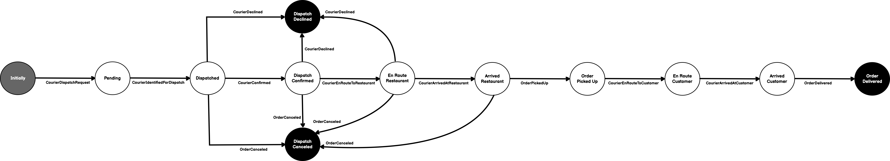

# OrderPaymentSystemExample

## Architecture

I imagined the following human actors: customer, chef/cook, kitchen staff, and courier, respectively.

- **Customer** - initiates the workflow by using a client app (e.g., DoorDash, etc.) to place a food order
- **Chef/Cook** - determines whether or not the order is valid, whether or not the kitchen can fulfill the order, prepares the food, and places the food on a shelf
for pick up
- **Kitchen Staff** - say something here
- **Courier** - arrives at the kitchen, picks up the order, and delivers said order back to the customer

#### What is an Order?

An order has several meanings. To better understand, lets look at the different perspectives.
- **Customer/Courier** - from the customer/courier perspective, an order is a single, atomic transaction between the client application (customer and courier) and the restaurant.
- **Restaurant** - from the restaurant perspective, an order is a single, atomic transaction between it and a courier. To most efficiently prepare the order, however, the restaurant may require that multiple cooks prepare each item within the order.
- **Chef/Cook** - from the chef/cook perspective, an order is a single food item he/she must prepare to fulfill the order.

Essentially, an order may consist of one or more items that must be prepared individually. That said, each item being prepared impacts the final state of the
order. Each order item has its own state as well as it is being prepared.

**Figure 2**

### Customer

### Cook

Cooks are dispatched when the order has been confirmed by the restaurant to have been valid.

### Kitchen Staff

### Courier

Couriers are dispatched when the order has been confirmed by the restaurant to have been valid.

